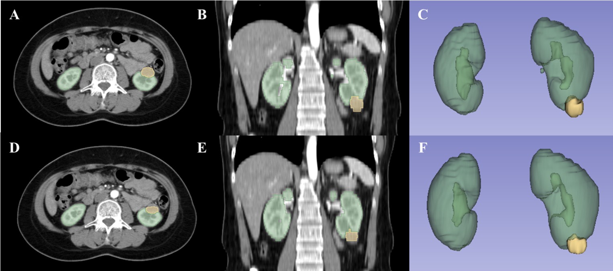
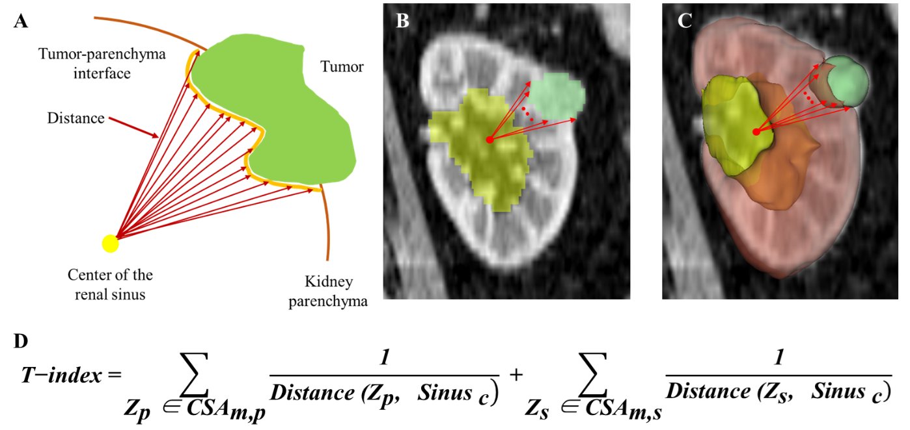

# T_index Calculation Pipeline

This repository contains scripts for Tumor index (T_index) analysis, specifically focusing on kidney CT images with the identification and analysis of tumors, cysts, and sinus regions.

## Dataset Structure

The dataset should be structured as follows:

```
Data/
  - mask/
    - patient_id/
      - imaging.nii.gz
      - segmentation.nii.gz
```

- `segmentation.nii.gz` labels are defined as:
  - 0: Background
  - 1: Kidney
  - 2: Tumor
  - 3: Cyst




## Processing Steps

### 1. Sinus Region Extraction

This step applies a convex hull algorithm to extract the sinus region from the segmentation data.

```bash
python src/Sinus_extraction.py --data_path 'data'
```

Output:
- `segmentation_sinus.nii.gz` (labels: 0=Background, 1=Kidney, 2=Tumor, 3=Cyst, 4=Sinus)

### 2. Resampling

To ensure consistent voxel spacings of 1mm<sup>3</sup>, the imaging and segmentation data are resampled.

```bash
python src/Resampling.py --data_path 'data'
```

Output:
- `imaging_r.nii.gz`
- `segmentation_sinus_r.nii.gz`

### 3. T Index Extraction

Extracts various indices from the processed imaging data to analyze the relationship between sinus and mass.

```bash
python src/extract_indices.py --data_path 'data'
```

Output:
- `result.npy` which includes:
  1. `dst_sn_m`: Distance between the sinus center and mass center.
  2. `dst_mp_sn`: Inverse of the sum of distances from the points on the mass-parenchyma contact surface to the sinus center.
  3. `dst_msn_sn`: Inverse of the sum of distances from the points on the mass-sinus contact surface to the sinus center.
  4. `mp_csa`: Contact surface area between mass and parenchyma.
  5. `msn_csa`: Contact surface area between mass and sinus.

The T_index is calculated as the sum of `dst_mp_sn` and `dst_msn_sn`.




## Requirements

This pipeline assumes that Python and necessary libraries (`nibabel`, `numpy`, `scipy`, `skimage`, `tqdm`, `batchgenerators`) are installed.

## Usage

Follow the instructions in each processing step. Ensure that your data path is correctly specified relative to the script's location.


## Automatic Segmentation from AI model (Optional)

If you want to start from AI predicted mask, you have to change the file "segmentation.nii.gz" to prediction.
We used [nn-UNet](https://github.com/MIC-DKFZ/nnUNet) to construct the AI model for kidney and tumor prediction.


